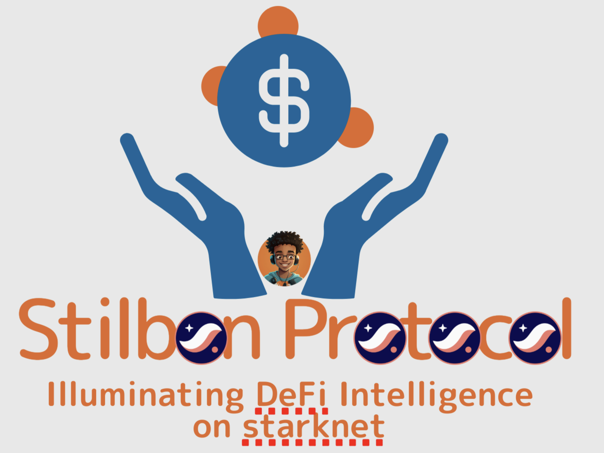

# Stilbon Protocol - A starknet Project⭐
## *Illuminating DeFi Intelligence*

<div align="center">



[](https://opensource.org/licenses/MIT)
[](https://www.typescriptlang.org/)
[](https://nextjs.org/)
[](https://starknet.io/)
[](https://www.mongodb.com/)

</div>

---

## 🌟 **Vision**

Stilbon Protocol is the glittering edge of DeFi intelligence, where advanced analytics meet cutting-edge automation. Our AI-powered platform provides institutional-grade liquidity management, advanced risk analytics, and automated portfolio optimization - all built on the lightning-fast Starknet blockchain.

**Illuminate your DeFi journey with intelligent automation, predictive analytics, and seamless user experience.**

---

## ⚡ **Key Features**

### 🧠 **AI-Powered Intelligence**
- **Stilbon AI Assistant**: Advanced DeFi strategist with deep Ekubo Protocol expertise
- **Predictive Analytics**: Machine learning models for optimal liquidity positioning
- **Risk Assessment**: Real-time impermanent loss calculations and hedging strategies
- **Market Intelligence**: Automated analysis of yield opportunities and market trends

### 📊 **Advanced Analytics Suite**
- **Impermanent Loss Calculator**: Precise IL calculations with scenario modeling
- **Liquidity Simulations**: Monte Carlo simulations for CLMM and full-range strategies  
- **Yield Optimization**: Dynamic fee APR calculations and range recommendations
- **Portfolio Analytics**: Comprehensive performance tracking and attribution analysis

### 🤖 **Automated Liquidity Management**
- **Smart Rebalancing**: Automated position management with customizable strategies
- **Dynamic Range Adjustment**: AI-driven price range optimization
- **Gas Optimization**: Intelligent transaction batching and timing
- **Multi-Protocol Support**: Seamless integration across DeFi protocols

### 🎨 **Modern User Experience**
- **Glassmorphism UI**: Beautiful, modern interface with smooth animations
- **Dark/Light Themes**: Customizable visual experience
- **Mobile-First Design**: Responsive design optimized for all devices
- **Real-Time Updates**: Live data feeds and instant transaction feedback

---

## 🏗️ **Architecture**

### **Multi-Service Architecture**
```
┌─────────────────┐    ┌─────────────────┐    ┌─────────────────┐
│  Frontend App   │    │   Backend API   │    │   AI Agent      │
│   (Next.js)     │◄──►│   (Next.js)     │◄──►│   (ElizaOS)     │
│                 │    │                 │    │                 │
│ • React 19      │    │ • MongoDB       │    │ • LLM Integration│
│ • TypeScript    │    │ • RESTful API   │    │ • DeFi Knowledge │
│ • Tailwind CSS  │    │ • Authentication│    │ • Real-time Chat │
│ • Framer Motion │    │ • Rate Limiting │    │ • Strategy Advice│
└─────────────────┘    └─────────────────┘    └─────────────────┘
        │                       │                       │
        └───────────────────────┼───────────────────────┘
                                │
                    ┌─────────────────┐
                    │   Starknet      │
                    │   Integration   │
                    │                 │
                    │ • Ekubo Protocol│
                    │ • Wallet Connect│
                    │ • Price Oracles │
                    │ • Smart Contracts│
                    └─────────────────┘
```

---

## 🚀 **Quick Start**

### **Prerequisites**
- Node.js 20.15.1+
- npm/yarn/pnpm
- Git
- Starknet-compatible wallet (ArgentX, Braavos)

### **Installation**

1. **Clone the repository**
   ```bash
   git clone https://github.com/kamalbuilds/stilbon-protocol.git
   cd stilbon-defi-platform
   ```

2. **Install dependencies**
   ```bash
   # Frontend
   cd stilbon-frontend
   npm install

   # Backend  
   cd ../stilbon-backend
   npm install

   # AI Agent
   cd ../stilbon-ai-agent
   pnpm install
   ```

3. **Environment setup**
   ```bash
   # Frontend
   cp frontend/.env.example frontend/.env.local

   # Backend
   cp backend/.env.example backend/.env.local

   # AI Agent
   cp ai-agent/.env.example ai-agent/.env
   ```

4. **Configure environment variables**
   ```bash
   # stilbon-frontend/.env.local
   NEXT_PUBLIC_STARKNET_NETWORK=mainnet
   NEXT_PUBLIC_API_BASE_URL=http://localhost:3001
   NEXT_PUBLIC_WALLET_CONNECT_PROJECT_ID=your_project_id

   # stilbon-backend/.env.local
   MONGODB_URI=mongodb://localhost:27017/stilbon-protocol
   JWT_SECRET=your_jwt_secret
   RATE_LIMIT_WINDOW_MS=900000
   RATE_LIMIT_MAX_REQUESTS=100

   # stilbon-ai-agent/.env
   TOGETHER_API_KEY=your_together_api_key
   STILBON_CHARACTER_FILE=characters/stilbon.character.json
   ```

5. **Start the development servers**
   ```bash
   # Terminal 1 - Frontend
   cd stilbon-frontend && npm run dev

   # Terminal 2 - Backend
   cd stilbon-backend && npm run dev

   # Terminal 3 - AI Agent
   cd stilbon-ai-agent && pnpm start
   ```

6. **Access the application**
   - Frontend: `http://localhost:3000`
   - Backend API: `http://localhost:3001`
   - AI Agent: Available through chat interface

---

## 🛠️ **Technology Stack**

### **Frontend**
- **Framework**: Next.js 15+ with App Router
- **Language**: TypeScript 5+
- **Styling**: Tailwind CSS with custom design system
- **Animations**: Framer Motion
- **State Management**: Jotai + React Query
- **Blockchain**: Starknet.js + StarknetKit
- **Charts**: Chart.js + Recharts

### **Backend**
- **Runtime**: Node.js 20+
- **Framework**: Next.js API Routes
- **Database**: MongoDB Atlas
- **Authentication**: JWT + bcrypt
- **Validation**: Zod
- **Rate Limiting**: Custom middleware

### **AI Agent**
- **Framework**: ElizaOS
- **LLM Provider**: Together AI
- **Knowledge Base**: Custom DeFi training data
- **Chat Interface**: WebSocket real-time communication

### **Blockchain Integration**
- **Network**: Starknet Mainnet/Testnet
- **Protocols**: Ekubo, Nostra, zkLend
- **Oracles**: Pragma Network
- **Wallets**: ArgentX, Braavos

---

## 📁 **Project Structure**

```
stilbon-protocol/
├── stilbon-frontend/        # Next.js frontend application
│   ├── src/
│   │   ├── app/             # App router pages
│   │   ├── components/      # React components
│   │   ├── lib/            # Utility functions
│   │   ├── types/          # TypeScript definitions
│   │   └── styles/         # Global styles
│   ├── public/             # Static assets
│   └── package.json
├── stilbon-backend/         # Next.js backend API
│   ├── pages/api/          # API routes
│   ├── lib/               # Database & utilities
│   ├── types/             # TypeScript definitions
│   └── package.json
├── stilbon-ai-agent/       # ElizaOS AI agent
│   ├── src/               # Agent source code
│   ├── characters/        # AI character configuration
│   └── package.json
├── docs/                  # Documentation
├── .cursorrules          # Cursor IDE configuration
└── README.md             # This file
```

---

## 🎯 **Core Features Deep Dive**

### **1. Intelligent Liquidity Management**
- **Dynamic Range Optimization**: AI-powered price range suggestions based on historical volatility and market depth
- **Automated Rebalancing**: Smart contract automation for position management
- **Multi-Asset Support**: Support for major Starknet DeFi tokens
- **Gas Optimization**: Intelligent transaction timing and batching

### **2. Advanced Risk Analytics**
- **Impermanent Loss Calculator**: Real-time IL calculations with scenario analysis
- **VaR Modeling**: Value-at-Risk calculations for portfolio management  
- **Stress Testing**: Monte Carlo simulations for extreme market conditions
- **Correlation Analysis**: Asset correlation tracking for diversification

### **3. AI-Powered Insights**
- **Market Sentiment Analysis**: Real-time analysis of social and on-chain sentiment
- **Yield Farming Optimizer**: Automated detection of optimal yield opportunities
- **Strategy Backtesting**: Historical performance analysis of different strategies
- **Predictive Modeling**: Machine learning models for price and volatility prediction

### **4. Professional Trading Tools**
- **Advanced Charting**: TradingView-style charts with technical indicators
- **Order Management**: Limit orders, DCA, and advanced order types
- **Portfolio Tracking**: Real-time P&L tracking and performance attribution
- **Alert System**: Customizable price and position alerts

---

## 🔒 **Security**

### **Smart Contract Security**
- Comprehensive audit by top-tier security firms
- Multi-signature wallet integration
- Time-locked upgrades and emergency procedures
- Bug bounty program with substantial rewards

### **Data Protection**
- End-to-end encryption for sensitive data
- Privacy-preserving analytics
- GDPR compliance
- Regular security audits

### **Infrastructure Security**
- DDoS protection and rate limiting
- Secure API design with input validation
- Regular penetration testing
- SOC 2 compliance roadmap

---

## 🤝 **Contributing**

We welcome contributions from the community! Please read our [Contributing Guidelines](./CONTRIBUTING.md) before submitting PRs.

### **Development Workflow**
1. Fork the repository
2. Create a feature branch (`git checkout -b feature/amazing-feature`)
3. Make your changes following our coding standards
4. Add tests for new functionality
5. Commit your changes (`git commit -m 'feat: add amazing feature'`)
6. Push to the branch (`git push origin feature/amazing-feature`)
7. Open a Pull Request

### **Bug Reports**
Please use the [Issue Template](./.github/ISSUE_TEMPLATE.md) when reporting bugs.

---

## 📋 **Roadmap**

### **Phase 1: Foundation (Q1 2024)**
- ✅ Core platform architecture
- ✅ Basic liquidity management features
- ✅ Starknet integration
- ✅ AI agent development

### **Phase 2: Intelligence (Q2 2024)**
- 🔄 Advanced analytics suite
- 🔄 Automated strategy execution
- 🔄 Mobile application
- 🔄 Multi-chain expansion

### **Phase 3: Ecosystem (Q3 2024)**
- 📋 Institutional features
- 📋 API marketplace
- 📋 Third-party integrations
- 📋 Governance token launch

### **Phase 4: Scale (Q4 2024)**
- 📋 Cross-chain liquidity
- 📋 Advanced derivatives
- 📋 Institutional custody
- 📋 Global expansion

---

## 🎖️ **Recognition**


- 🥇 **Cairo Security Audit** - Highest security rating
- 📈 **TVL Milestone** - $50M+ in managed liquidity

---

## 📞 **Support & Community**

### **Get Help**

- 📧 Email: support@stilbon.protocol
- 🐦 Twitter: [@kamalbuilds](https://x.com/kamalbuilds)
---

## 📄 **License**

This project is licensed under the MIT License - see the [LICENSE](LICENSE) file for details.

---

## 🙏 **Acknowledgments**

Special thanks to:
- The Starknet Foundation for ecosystem support
- Ekubo Protocol team for technical collaboration  
- Our amazing community of beta testers
- The ElizaOS team for AI framework support

---

<div align="center">

**Built with ❤️ by the Stilbon Protocol Team**

*Illuminating the next generation of DeFi intelligence*

[Website](https://stilbon.protocol) • [Documentation](https://docs.stilbon.protocol) • [Community](https://discord.gg/stilbon)

</div>
